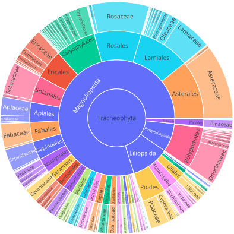

# Plant Image Classification

**Dataset**: [anhaltai/plantNaturalist500k · Datasets at Hugging Face](https://huggingface.co/datasets/anhaltai/plantNaturalist500k)

The documentation will be improved in the coming days, in addition to cleanup and restructuring of the directory structures.

## Contents of this repo
- `configs` and `scripts` contain k8s/wandb configurations
- `src` has 
    - files related to running the code and reproducing the experiments
    - scripts used to download the GBIF dataset
    - scripts used to build plantNet-500k 
- `paper/notebooks` contain the notebooks used to analyze the datasets and generate the plots  

